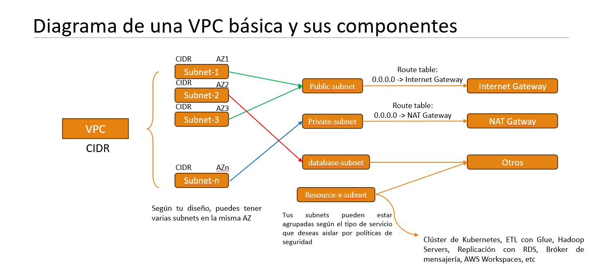

# Laboratorio 3

---

Este laboratorio utilizara los servicios de VPC, Transit Gateway, RDS, DMS, EC2. 

## Instrucciones del ejercicio de VPC:

  * Deben elegir grupos de 1 o 2 personas y se les asignara una letra: `A`, `B`,`C`, `D`, ...
  * El instructor creara una VPC publica de nombre: `public-main-vpc` con 2 subnets publicas en las zonas `1a` y `1b` de nombre `main-public-subnet-<number>`.
  * Cada grupo creara una VPC privada con nombre igual asu grupo segun esta tabla:

      

| Grupo | VPC name | CIDR block  |
|:-----:|:--------:|:-----------:|
 |   A   |    A     | 10.1.0.0/16 |
 |   B   |    B     | 10.2.0.0/16 |
 |   C   |    C     | 10.3.0.0/16 |
|  ...  |   ...    |     ...     |

  * Cada grupo "`X`" creara una subnets privadas (sin NAT Gateway) en las Az `1a` y `1b` con la nomenclatura `X-private-subnet-<number>` , con bloques CIDR `10.<particion del grupo>.<number>.0/24`, ejemplo: `10.7.1.0/24` en Az `1a`, `10.7.2.0/24` en AZ `1b`
  * Editar el Route Table creado por defecto renombrandolo como `route-table-vpc-<Grupo>` y asociar las dos subnets privadas.
  * El instructor creara un unico Transit Gateway de nombre `Main-Transit-Gateway`
  * Cada grupo "`X`" creara un `Transit Gateway Attachment` con nomenclatura `attachment-X-vpc`.
  * El instructor creara un unico Transit Gateway Route Table con nombre `main-transit-gateway-route-table`.
  * Cada grupo debera crear una asociacion y propagacion para cada subnet en ell `main-transit-gateway-route-table`.
  * El instructor editara el Route Table de la VPC `public-main-vpc` agregando el destino `10.0.0.0/8` hacia el Transit Gateway.
  * Cada grupo editara las rutas de su Route Table agregando la propagacion del CIDR de la VPC principal hacia el Transit Gateway.

## Instrucciones del ejercicio de VPC + Conectividad:

 * El instructor creara una `EC2` en la vpc publica `public-main-vpc` en cualquier subnet llamada `public-instance`.
 * Cada grupo "`X`" creara una `EC2` en la vpc privada `X` usando la subnet de la Az `1a`, con IP publica. La nomenclatura sera `private-vpc-X`
   Deberan utilizar su llave PEM y el grupo de seguridad por defecto, renombrandolo `default-vpc-X`. Modificar las reglas de entrada para permitirles acceso `SSH`
 * Cada grupo se conectara a la instancia publica `public-instance` e intentara hacer `ping` a la instancia privada `private-vpc-X` que le corresponde utilizando su IP Publica e IP Privada.
 * Cada grupo "`X`" agregara la regla de entrada de su grupo de seguridad por defecto, permitiendo el acceso del CIDR de la vpc `public-main-vpc`.
 * Probar nuevamente el `ping` hacia la IP Publica e IP Privada de `private-vpc-X`. **Comentar los resultados**.

## Instrucciones del ejercicio de DMS + RDS

* Cada grupo creara una `Subnet group` correspondiente a sus dos Az y sus dos subnets privadas en su respectiva VPC privada. La llamaran `dbprivate-vpc-<grupo>`.
* Cada grupo creara una una base de datos `MSSQL` con opciones por defecto, sin opciones de monitoreo, logs, backup, etc en la subnet `dbprivate-vpc-<grupo>`.
* El instructor creara una Subnet y una Replication Instance que permita la conectividad de todas sus bases de datos.
* El instructor creara un Endpoint del tipo Source hacia una `MSSQL` en un on-premisse. La on premise tiene password `domain123#` y la tabla origen es `domaintest.dbo.UsuariosCapacitacion`
* Cada grupo creara un Endpoint del tipo Target hacia su `MSSQL` creado en RDS.
* Cada grupo realizara la tarea de migracion de tablas

Para confirmar la migracion, deberan hacer un "puente SSH" hacia su base de datos a traves de la instancia publica. Se recomienda que cada grupo use un puerto local distinto.

`ssh -L <local-port>:<database_ip>:<database-port> ec2-user@<ip-public-instance> -N`

Probar la conexion a su base de datos en su DB Manager favorito, apuntando a `local-port`.

